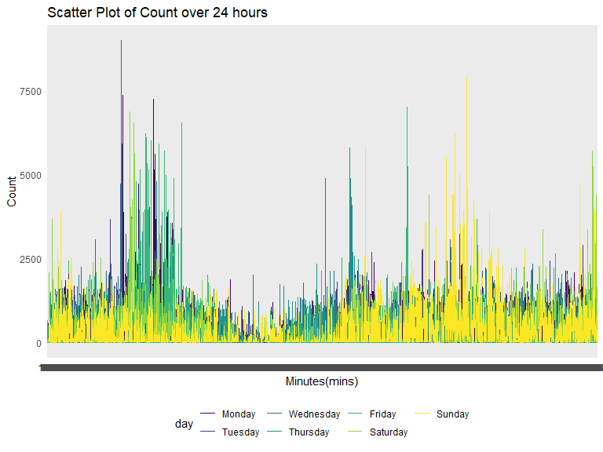

p8105_hw3_hg2596
================
2022-10-18

### Problem 0

This solution focuses on a reproducible report containing code and text
necessary for Problems 1-3, and is organized as an R Project. This was
not prepared as a GitHub repo; examples for repository structure and git
commits should be familiar from other elements of the course.

Throughout, we use appropriate text to describe our code and results,
and use clear styling to ensure code is readable.

### Problem 1

#### Read in the data

``` r
data("instacart")

instacart = 
  instacart %>% 
  as_tibble(instacart)
```

#### Answer questions about the data

This dataset contains 1384617 rows and 15 columns, with each row
resprenting a single product from an instacart order. Variables include
identifiers for user, order, and product; the order in which each
product was added to the cart. There are several order-level variables,
describing the day and time of the order, and number of days since prior
order. Then there are several item-specific variables, describing the
product name (e.g. Yogurt, Avocado), department (e.g. dairy and eggs,
produce), and aisle (e.g. yogurt, fresh fruits), and whether the item
has been ordered by this user in the past. In total, there are 39123
products found in 131209 orders from 131209 distinct users.

Below is a table summarizing the number of items ordered from aisle. In
total, there are 134 aisles, with fresh vegetables and fresh fruits
holding the most items ordered by far.

``` r
instacart %>% 
  count(aisle) %>% 
  arrange(desc(n))
```

    ## # A tibble: 134 × 2
    ##    aisle                              n
    ##    <chr>                          <int>
    ##  1 fresh vegetables              150609
    ##  2 fresh fruits                  150473
    ##  3 packaged vegetables fruits     78493
    ##  4 yogurt                         55240
    ##  5 packaged cheese                41699
    ##  6 water seltzer sparkling water  36617
    ##  7 milk                           32644
    ##  8 chips pretzels                 31269
    ##  9 soy lactosefree                26240
    ## 10 bread                          23635
    ## # … with 124 more rows

Next is a plot that shows the number of items ordered in each aisle.
Here, aisles are ordered by ascending number of items.

``` r
instacart %>% 
  count(aisle) %>% 
  filter(n > 10000) %>% 
  mutate(aisle = fct_reorder(aisle, n)) %>% 
  ggplot(aes(x = aisle, y = n)) + 
  geom_point() + 
  labs(title = "Number of items ordered in each aisle") +
  theme(axis.text.x = element_text(angle = 60, hjust = 1))
```


Our next table shows the three most popular items in aisles
`baking ingredients`, `dog food care`, and `packaged vegetables fruits`,
and includes the number of times each item is ordered in your table.

``` r
instacart %>% 
  filter(aisle %in% c("baking ingredients", "dog food care", "packaged vegetables fruits")) %>%
  group_by(aisle) %>% 
  count(product_name) %>% 
  mutate(rank = min_rank(desc(n))) %>% 
  filter(rank < 4) %>% 
  arrange(desc(n)) %>%
  knitr::kable()
```

| aisle                      | product_name                                  |    n | rank |
|:---------------------------|:----------------------------------------------|-----:|-----:|
| packaged vegetables fruits | Organic Baby Spinach                          | 9784 |    1 |
| packaged vegetables fruits | Organic Raspberries                           | 5546 |    2 |
| packaged vegetables fruits | Organic Blueberries                           | 4966 |    3 |
| baking ingredients         | Light Brown Sugar                             |  499 |    1 |
| baking ingredients         | Pure Baking Soda                              |  387 |    2 |
| baking ingredients         | Cane Sugar                                    |  336 |    3 |
| dog food care              | Snack Sticks Chicken & Rice Recipe Dog Treats |   30 |    1 |
| dog food care              | Organix Chicken & Brown Rice Recipe           |   28 |    2 |
| dog food care              | Small Dog Biscuits                            |   26 |    3 |

Finally is a table showing the mean hour of the day at which Pink Lady
Apples and Coffee Ice Cream are ordered on each day of the week. This
table has been formatted in an untidy manner for human readers. Pink
Lady Apples are generally purchased slightly earlier in the day than
Coffee Ice Cream, with the exception of day 5.

``` r
instacart %>%
  filter(product_name %in% c("Pink Lady Apples", "Coffee Ice Cream")) %>%
  group_by(product_name, order_dow) %>%
  summarize(mean_hour = mean(order_hour_of_day)) %>%
  spread(key = order_dow, value = mean_hour) %>%
  knitr::kable(digits = 2)
```

    ## `summarise()` has grouped output by 'product_name'. You can override using the
    ## `.groups` argument.

| product_name     |     0 |     1 |     2 |     3 |     4 |     5 |     6 |
|:-----------------|------:|------:|------:|------:|------:|------:|------:|
| Coffee Ice Cream | 13.77 | 14.32 | 15.38 | 15.32 | 15.22 | 12.26 | 13.83 |
| Pink Lady Apples | 13.44 | 11.36 | 11.70 | 14.25 | 11.55 | 12.78 | 11.94 |

Note that the `echo = FALSE` parameter was added to the code chunk to
prevent printing of the R code that generated the plot.

# Problem 2

``` r
accel_1 = read_csv("./data/accel_data.csv")%>%
  janitor::clean_names() 
```

    ## Rows: 35 Columns: 1443
    ## ── Column specification ────────────────────────────────────────────────────────
    ## Delimiter: ","
    ## chr    (1): day
    ## dbl (1442): week, day_id, activity.1, activity.2, activity.3, activity.4, ac...
    ## 
    ## ℹ Use `spec()` to retrieve the full column specification for this data.
    ## ℹ Specify the column types or set `show_col_types = FALSE` to quiet this message.

``` r
accel_2 =  pivot_longer(
    accel_1, 
    activity_1:activity_1440,
    names_to = "mins",  
    names_prefix = "activity_",
    values_to = "count"
    ) %>%
  mutate(Week_identify = ifelse(day%in%c("Saturday", "Sunday"), 2, 1)) %>%
  mutate(day = fct_relevel(day,"Monday","Tuesday","Wednesday", "Thursday", "Friday","Saturday", "Sunday"))
```

Originally had over 1440 columns, the following variables were: **week**
(1-5),**day_ID** (just a count), **day** (Mon-Sun), **activity_1**,
**activity_2**…activity count following the patient 24 hours.

Now, after pivoting longer, we are able to put the counts is **counts**
making it one variable,and made a new variable **mins** to kep track
which count came from which minute of the week.

There are now 50400 observations and 6 wows

``` r
accel_3 = 
accel_2 %>%
  mutate(day = as.factor(day))%>%
  group_by(week,day) %>%
  summarize(total_activity = sum(count))
```

    ## `summarise()` has grouped output by 'week'. You can override using the
    ## `.groups` argument.

maybe ad false = true so the high can come to the beginning

``` r
accel_4 = accel_3 %>%
  pivot_wider(
  names_from = "day", 
  values_from = "total_activity")

accel_4 
```

    ## # A tibble: 5 × 8
    ## # Groups:   week [5]
    ##    week  Monday Tuesday Wednesday Thursday  Friday Saturday Sunday
    ##   <dbl>   <dbl>   <dbl>     <dbl>    <dbl>   <dbl>    <dbl>  <dbl>
    ## 1     1  78828. 307094.   340115.  355924. 480543.   376254 631105
    ## 2     2 295431  423245    440962   474048  568839    607175 422018
    ## 3     3 685910  381507    468869   371230  467420    382928 467052
    ## 4     4 409450  319568    434460   340291  154049      1440 260617
    ## 5     5 389080  367824    445366   549658  620860      1440 138421

**Question 1; Part 2** Any trends apparent?

A big drop on the weekends.

Just eyeballing the table, it looks like the for week 4 and week 5 there
is a **big drop** in counts on Saturday. On average, Mondays on average
higher counts. Overall, though its difficult to see very apparent trends
just based on the table.

``` r
ggplot(accel_2, aes(x = mins, y = count, color = day)) + 
  geom_line()
```



**Question 1; Part 3**

Describe any patterns or conclusions

There is a lot of data, so it is very difficult to distinguish
patterns.However, some of the trends is that that count on **average is
below 2500**. Another trend is there seems to be peak minutes when the
count goes above the average count, its difficult to know exactly what
exact minutes but it seems their are **two high peaks** during the
morning and later on toward the latter portion of the 24 hour period.
